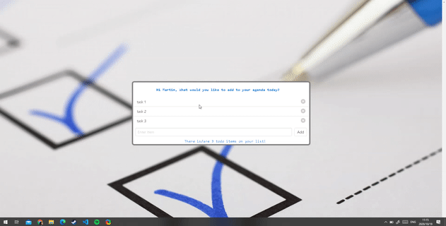

# todo-list-react
A todo list React app that allows users to add or remove items from the todo list provided.

## Demo display of web page:

## Use of code:
* Load files onto local drive.
* Use a text editor to open root folder.
* Type "npm i" |or| "npm install" in the terminal to install node-modules.
* After installing node-modules, type "npm start".
* The profile should automatically open up in the browser for you to view.

Happy Coding :sunglasses:
